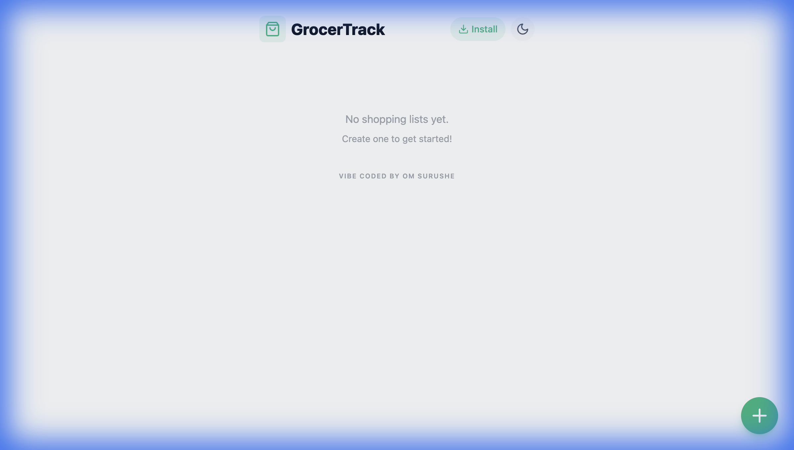

<div align="center">

# GrocerTrack

**A minimal, installable shopping list PWA**

[](https://react.dev)
[](https://typescriptlang.org)
[](https://vitejs.dev)
[](https://web.dev/progressive-web-apps/)
[](https://github.com/om-surushe/grocertrack-pwa/actions/workflows/ci.yml)

[**Live Demo →**](https://grocertrack.vercel.app/)

</div>

---

## ✨ Features

- 📱 **Installable** — Add to home screen for a native app experience
- 🌙 **Dark Mode** — Auto-detects system preference
- 💾 **Offline Ready** — All data stored locally in browser
- ⚡ **Fast & Lightweight** — No backend, no accounts, just lists

## 📸 Screenshot

<div align="center">

</div>


## 🛠 Tech Stack

| Category | Technology |
|----------|------------|
| Framework | React 19 |
| Language | TypeScript 5.8 |
| Build Tool | Vite 6 |
| Storage | localStorage |
| Hosting | Vercel |

## 🚀 Getting Started

**Prerequisites:** Node.js 18+

```bash
# Clone the repo
git clone https://github.com/om-surushe/grocertrack-pwa.git
cd grocertrack-pwa

# Install dependencies
npm install

# Start dev server
npm run dev
```

Open [http://localhost:5173](http://localhost:5173) in your browser.

## 📦 Build

```bash
npm run build
npm run preview
```

---

## 🤝 Contributing

Contributions are welcome! Feel free to open an issue or submit a pull request.

1. Fork the repository
2. Create your feature branch (`git checkout -b feature/awesome-feature`)
3. Commit your changes (`git commit -m 'feat: add awesome feature'`)
4. Push to the branch (`git push origin feature/awesome-feature`)
5. Open a Pull Request

## 📄 License

This project is licensed under the [MIT License](./LICENSE).

---

<div align="center">
Made with ☕ by <a href="https://github.com/om-surushe">Om Surushe</a>
</div>
